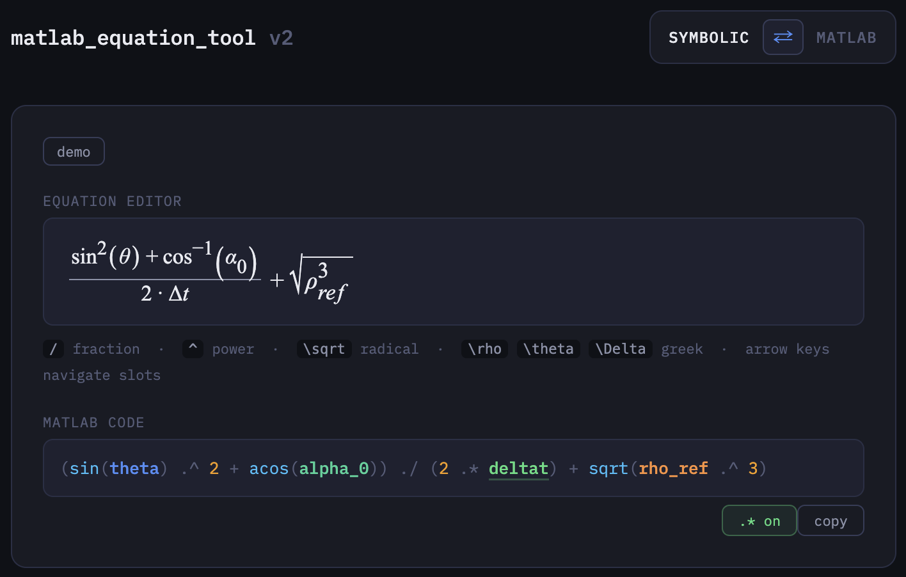

# EqTool — MATLAB Bidirectional Equation Visualizer

**Current File Exchange Version:** v1.2.1

A bidirectional equation tool that runs inside MATLAB. Paste MATLAB code to see it rendered as symbolic math, or type equations in a live editor to generate valid MATLAB code.

## Quick Start (After Install)

Launch EqTool in either of these ways:

1. **Apps tab (recommended)**: click **Launch EqTool**
2. **Command Window**: run `EqTool`



## Installation

**Option A — MATLAB File Exchange**
1. Open MATLAB → Add-Ons → Get Add-Ons
2. Search **EqTool**
3. Click Install

**Option B — Direct from GitHub**
1. Download the full repo (or at minimum `EqTool.m`, `matlab_equation_tool.html`, `styles/`, and `src/js/`)
2. Preserve the folder structure
3. Add that folder to your MATLAB path
4. Run `EqTool`

## Requirements

- MATLAB R2022b or later
- Internet connection on first launch only

## Usage

**MATLAB → Symbolic mode** (default)

Type or paste any MATLAB expression into the code field. The symbolic view updates live.

```matlab
(sin(theta)^2 + acos(alpha_0)) / (2 * delta_t) + sqrt(rho_ref^3)
```

**Symbolic → MATLAB mode**

Click the `⇄` button to switch. Type directly into the equation editor:

| Key | Action |
|-----|--------|
| `/` | Fraction |
| `^` | Superscript |
| `\sqrt` | Radical |
| `\rho`, `\theta`, `\Delta` | Greek letters |
| `\sin`, `\arccos` | Trig functions |
| Arrow keys | Navigate slots |

## Features

- **MATLAB → Symbolic** — paste any expression and see it rendered with proper fractions, radicals, trig powers, and color-coded variables
- **Symbolic → MATLAB** — live MathQuill equation editor outputs valid MATLAB code
- **Ambiguity detection** — flags greek-letter juxtaposition (e.g. `Δt` could be `delta_t` or `delta * t`) and lets you resolve with a click
- **Auto-setup** — downloads and bundles all dependencies on first run, no manual install steps
- **Full inverse trig** — `acos`, `arccos`, `cos⁻¹` all recognized in both directions

## Packaging

Packaging is for maintainers. End users should install from MATLAB Add-On Explorer.

To build a `.mltbx` for distribution:

```matlab
cd('/path/to/EqTool')
EqTool_package()
```

Requires MATLAB R2023a or later to package. The tool itself runs on R2022b+.

## Files

| File | Description |
|------|-------------|
| `EqTool.m` | Main launcher — self-bundling on first run |
| `matlab_equation_tool.html` | Tool UI shell — references modular CSS/JS files |
| `styles/main.css` | UI styling |
| `src/js/core.js` | Parser/conversion core (MATLAB <-> LaTeX, ambiguity, vectorization) |
| `src/js/ui.js` | DOM/UI wiring and interactions |
| `EqTool_package.m` | Run once to build `EqTool.mltbx` for distribution |
| `tests/core.test.js` | Automated Node tests for parsing and conversion logic |
| `TESTING.md` | Full automated + manual test checklist |

## Development

### Run automated tests

```bash
npm test
```

All tests must pass before committing parser or conversion changes.

### Manual verification

Follow `TESTING.md` for browser and MATLAB smoke tests.

## License

MIT
